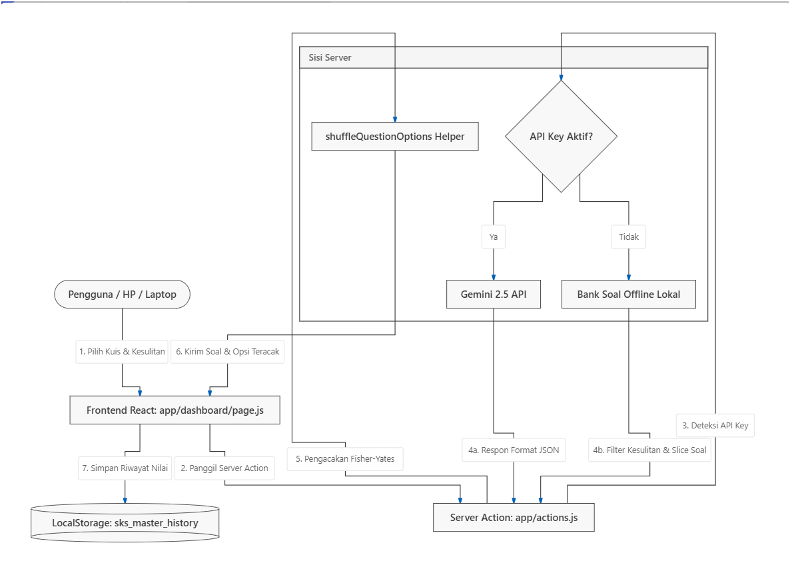

# SPESIFIKASI TEKNIS APLIKASI: SKS-MASTER
> **Melaju Kencang dengan AI: Kuasai Ujian dalam Semalam**
> Dokumen Spesifikasi Resmi untuk Bahan Presentasi Gemini Innovation Hackathon 2026

---

## 1. RINGKASAN EKSEKUTIF (EXECUTIVE SUMMARY)

### Latar Belakang & Problem Statement
*   **Sindrom SKS (Sistem Kebut Semalam)**: Kebiasaan belajar mahasiswa/pelajar mendekati hari H ujian memerlukan sarana latihan soal yang instan, relevan, dan adaptif tanpa proses administrasi akun atau penyiapan database yang rumit.
*   **Kelemahan Kuis Tradisional**: Bank soal statis membuat pelajar menghafal pola jawaban (misalnya jawaban benar selalu di opsi A), bukan memahami konsep akademis.
*   **Integritas Ujian**: Minimnya proteksi kecurangan pada latihan kuis online mandiri yang memicu siswa untuk menyontek via tab browser lain.

### Solusi: SKS-Master
**SKS-Master** adalah platform *SaaS (Software as a Service)* latihan kuis instan berbasis **PWA (Progressive Web App)** dan **Serverless** yang ditenagai oleh **Gemini AI API (model gemini-2.5-flash)**. Aplikasi ini dirancang tanpa database eksternal (*database-free*), mengandalkan *browser state* lokal secara penuh, serta dilengkapi proteksi integritas akademik dan optimasi kegunaan seluler (*mobile usability*).

---

## 2. TECH STACK & TEKNOLOGI UTAMA

| Komponen | Teknologi | Deskripsi / Alasan Pemilihan |
| :--- | :--- | :--- |
| **Framework Core** | Next.js 16 (App Router) | Menggunakan arsitektur React modern berbasis Server Actions untuk komunikasi server-client instan dan rendering cepat. |
| **Styling Engine** | Tailwind CSS v4 & Vanilla CSS | Mengakomodasi desain modern adaptif (Dark/Light mode), animasi dinamis, serta efek kaca transparan (*glassmorphism*). |
| **Kecerdasan Buatan** | Google Gemini AI API (`gemini-2.5-flash`) | Generasi kuis akademis yang cerdas, perumusan pembahasan materi mendalam, dan pembuatan pilihan pengecoh (*distractor options*) secara adaptif. |
| **Penyimpanan Data** | Browser LocalStorage | *Database-free design* & menjamin privasi nilai pengguna 100% lokal tanpa risiko kebocoran data di server awan. |
| **PWA Engine** | Next-PWA (Service Worker) | Mendukung instalasi aplikasi di HP, caching aset offline, serta akses instalasi mandiri dari browser. |
| **Icons Library** | Lucide React | Menyediakan aset ikon minimalis dan profesional. |

---

## 3. ARSITEKTUR & ALUR DATA (DATA FLOW)

Aplikasi SKS-Master bekerja menggunakan arsitektur aliran data *Serverless-to-Client* yang efisien.



### Penjelasan Deteksi Jaringan / API Key:
1.  **Online Mode**: Jika `GEMINI_API_KEY` terkonfigurasi, aplikasi memanfaatkan kecerdasan model generatif untuk meracik pertanyaan unik dari subjek apa pun.
2.  **Offline Fallback Mode**: Jika API key tidak ada, aplikasi otomatis beralih menggunakan basis data lokal sebanyak 15 soal per mata pelajaran dengan tag kesulitan dinamis.

---

## 4. FITUR UNGGULAN APLIKASI

### A. AI Quiz Generator Adaptif
*   **Parameter Dinamis**: Pengguna dapat memilih 3 parameter utama sebelum memulai kuis:
    1.  **Subjek**: Topik ujian (misal: Pengetahuan Kuantitatif, Biologi, Ilmu Komputer, dll).
    2.  **Jumlah Soal**: Opsi 5, 10, atau 15 pertanyaan secara dinamis.
    3.  **Tingkat Kesulitan**: Mudah (dasar/langsung), Sedang (analisis menengah), dan Sulit (studi kasus mendalam / HOTS).

### B. Proteksi Keamanan Ujian (Exam Integrity Protection)
Mencegah kecurangan mandiri pengguna dengan sistem pantau:
*   **Fullscreen Mode**: Kuis memaksa browser masuk ke mode layar penuh.
*   **Exit-Focus Detection**: Jika pengguna keluar dari mode fullscreen atau memindahkan fokus tab browser lebih dari 2 kali untuk mencari jawaban di internet, sistem secara sepihak membatalkan pengerjaan kuis, menghapus progres nilai berjalan, dan mereset kuis ke menu awal.

### C. Dasbor Statistik & Riwayat Ujian Mandiri
*   **Metrik Kemajuan**: Menyajikan total kuis yang dikerjakan, rata-rata akurasi, dan grafik representasi subjek terfavorit.
*   **Ekspor-Impor Sesi Tunggal**: Pengguna dapat mencadangkan (*back up*) atau membagikan riwayat skor per sesi kuis dalam berkas `.json` kecil dan mengunggahnya kembali tanpa menimpa data yang telah ada.
*   **Hapus Data Fleksibel**: Mendukung penghapusan log kuis satu per satu menggunakan ikon tempat sampah merah Google (`#DB4437`) maupun penghapusan total secara instan.

### D. PWA "Samsung Edge Panel" di HP
*   **Desktop Interface**: Tombol download/install melayang bulat di pojok kanan bawah yang melebar saat kursor menempel (*hover*).
*   **Mobile Interface**: Mengubah tombol instalasi menjadi "Edge Panel" tersembunyi di sisi kanan layar. Pengguna HP cukup menyapu (*swipe*) ke arah kiri pada garis handle vertikal minimalis untuk memunculkan menu instalasi PWA secara instan dan mengetuk tombol silang 'x' untuk menutup panel.

---

## 5. ALGORITMA UTAMA KODE

### A. Algoritma Pengacakan Opsi Jawaban (Fisher-Yates Shuffle)
Untuk mencegah kunci jawaban menumpuk pada pilihan A (indeks ke-0), SKS-Master memisahkan prefiks abjad kuis, mengacak teks jawaban, memetakan kembali indeks jawaban yang benar, lalu menyatukan kembali struktur data kuis sebelum disajikan ke pengguna.

```javascript
export function shuffleQuestionOptions(questions) {
  return questions.map(q => {
    // 1. Dapatkan string opsi asli & jawaban benar asli
    const originalOptions = [...q.options];
    const correctAnswerText = originalOptions[q.correct_answer_index];

    // 2. Bersihkan prefiks huruf (misal: "A. Aljabar" -> "Aljabar")
    const cleanOptions = originalOptions.map(opt => opt.replace(/^[A-E]\.\s*/, ''));
    const cleanCorrectText = correctAnswerText.replace(/^[A-E]\.\s*/, '');

    // 3. Lakukan Algoritma Pengacakan Fisher-Yates
    for (let i = cleanOptions.length - 1; i > 0; i--) {
      const j = Math.floor(Math.random() * (i + 1));
      [cleanOptions[i], cleanOptions[j]] = [cleanOptions[j], cleanOptions[i]];
    }

    // 4. Cari tahu indeks baru dari jawaban benar setelah diacak
    const newCorrectIndex = cleanOptions.indexOf(cleanCorrectText);

    // 5. Rakit kembali prefiks huruf (A, B, C, D, E) pada pilihan jawaban
    const alphabet = ['A', 'B', 'C', 'D', 'E'];
    const finalOptions = cleanOptions.map((text, idx) => `${alphabet[idx]}. ${text}`);

    return {
      ...q,
      options: finalOptions,
      correct_answer_index: newCorrectIndex !== -1 ? newCorrectIndex : q.correct_answer_index
    };
  });
}
```

### B. Filter Tingkat Kesulitan Offline
Dalam kondisi offline, data disaring menggunakan tag kesulitan kustom sebelum diacak dan disajikan ke UI.

```javascript
// Memfilter soal offline berdasarkan tingkat kesulitan yang dipilih
const filtered = FALLBACK_QUESTIONS[subject].filter(q => q.difficulty === difficulty);
// Lakukan pengacakan soal dan ambil sebanyak jumlah yang diminta
const selectedQuestions = shuffleArray(filtered).slice(0, limitCount);
```

---

## 6. AESTHETICS & BRANDING IDENTITY

*   **Identitas Warna Google/Gemini**: 
    *   Logo baru minimalis di bagian header kiri menampilkan logo bulat biru Google (`#4285F4`) dan bar persegi panjang 4 warna legendaris: Biru (`#4285F4`), Hijau (`#0F9D58`), Kuning (`#F4B400`), dan Merah (`#DB4437`).
    *   Favicon aplikasi dirancang sebagai vektor SVG transparan edge-to-edge yang terintegrasi secara dinamis ke Next.js App Router melalui rute `/icon.svg` dan `/icon-maskable.svg` untuk kompatibilitas *masking* Android One UI.
*   **Desain Premium**:
    *   Efek transisi micro-interactions pada tombol floating install.
    *   Desain panel samping *glassmorphism* di mobile dengan filter `backdrop-blur-md` dan paduan warna gelap pekat kontras tinggi untuk kenyamanan mata saat belajar di malam hari.
